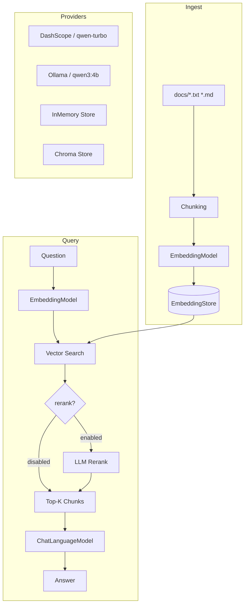

# LangChain4j + Spring Boot — Pluggable RAG Demo

A Spring Boot project integrating LangChain4j with **pluggable LLM and Embedding providers** (DashScope / Ollama) and a **pluggable vector store** (InMemory / Chroma), designed for interview-oriented RAG experimentation.

---

## Architecture



---

## Quick Start

### 1. Configure your API key

Create `src/main/resources/application-local.properties` (not committed):

```properties
# DashScope (default provider)
dashscope.api-key=your-real-dashscope-api-key

# Optional: RAG docs directory
# rag.docs.dir=/path/to/your/docs
```

### 2. Run with local profile

```bash
mvn spring-boot:run -Dspring-boot.run.profiles=local
```

Open http://localhost:8090 in your browser.

---

## Switching Providers

All providers are controlled by three properties (can also be set via env vars):

| Property | Options | Default | Env Var |
|----------|---------|---------|---------|
| `llm.provider` | `dashscope` \| `ollama` | `dashscope` | `LLM_PROVIDER` |
| `embedding.provider` | `dashscope` \| `ollama` | `dashscope` | `EMBEDDING_PROVIDER` |
| `vector.store` | `inmemory` \| `chroma` | `inmemory` | `VECTOR_STORE` |

### DashScope (default)

```properties
llm.provider=dashscope
embedding.provider=dashscope
dashscope.api-key=sk-...
dashscope.model=qwen-turbo
dashscope.model.strong=qwen-plus
dashscope.temperature=0.7
dashscope.embedding-model=text-embedding-v3
```

Switch to strong model:
```bash
DASHSCOPE_MODEL=qwen-plus mvn spring-boot:run -Dspring-boot.run.profiles=local
```

### Ollama (local)

First start Ollama:

```bash
# Pull models
ollama pull nomic-embed-text
ollama pull qwen3:4b

# Serve (defaults to http://localhost:11434)
ollama serve
```

Then configure:

```properties
llm.provider=ollama
embedding.provider=ollama
ollama.base-url=http://localhost:11434
ollama.chat-model=qwen3:4b
ollama.embedding-model=nomic-embed-text
ollama.temperature=0.7
ollama.timeout=60
```

Or via env vars:

```bash
LLM_PROVIDER=ollama EMBEDDING_PROVIDER=ollama mvn spring-boot:run -Dspring-boot.run.profiles=local
```

---

## Vector Store: Chroma

Start Chroma via Python (requires `chromadb` package):

```bash
pip install chromadb
chroma run --host 0.0.0.0 --port 8000 --path ./chroma-data
```

Then configure:

```properties
vector.store=chroma
chroma.base-url=http://localhost:8000
chroma.collection=rag-default
```

> **Chroma v2 API:** This project uses **LangChain4j ≥ 1.7.1** which targets the Chroma v2 REST API
> (`/api/v2/...` endpoints). Set `chroma.base-url` to the root of your Chroma server
> (e.g. `http://localhost:8000`); the `/api/v2` path prefix is handled automatically by the library.
>
> **Chroma 1.0.0 or later is required.** Older Chroma servers (< 1.0.0) that only expose the v1 API
> are not compatible with this configuration.

> **Important:** Use different collection names per embedding provider to avoid mixing vector spaces.
> E.g., `chroma.collection=rag-dashscope` vs `chroma.collection=rag-ollama`.

### Troubleshooting Chroma connection errors

| Symptom | Likely cause | Fix |
|---------|-------------|-----|
| `405 Method Not Allowed` or `404 Not Found` when starting with `vector.store=chroma` | Chroma server version < 1.0.0 (exposes only v1 API) | Upgrade Chroma: `pip install --upgrade chromadb` |
| `Connection refused` | Chroma is not running | Start it: `chroma run --host 0.0.0.0 --port 8000 --path ./chroma-data` |
| Bean creation error for `EmbeddingStore` on startup | `vector.store` property not resolved | Ensure `application-local.properties` or env var `VECTOR_STORE=chroma` is set |

---

## API Endpoints

| Method | Path | Description |
|--------|------|-------------|
| POST | `/api/chat` | Chat with memory (sessionId) |
| POST | `/api/chat/stream` | Streaming chat (SSE) |
| POST | `/api/agent/chat` | Agent with tool calling |
| POST | `/api/rag/reindex` | Build/rebuild RAG index |
| POST | `/api/rag/ask` | RAG-based question answering |
| GET  | `/api/rag/search?q=...` | Debug retrieval (topK + scores) |
| GET  | `/api/rag/stats?n=10` | Index stats + provider info |
| GET  | `/api/health` | Health check |
| GET  | `/api/config` | Active config info |

### Reindex

```bash
curl -X POST http://localhost:8090/api/rag/reindex
# {"chunksIndexed": 5}
```

### Ask

```bash
curl -X POST http://localhost:8090/api/rag/ask \
  -H "Content-Type: application/json" \
  -d '{"question": "What is RAG?"}'
```

### Search (debug retrieval quality)

```bash
curl "http://localhost:8090/api/rag/search?q=What+is+RAG"
# Returns topK results with scores, sourceId, textPreview, metadata
```

### Stats

```bash
curl "http://localhost:8090/api/rag/stats?n=20"
# {"chunks":5,"vectorDimMax":1536,"estimatedVectorBytes":30720,
#  "llmProvider":"dashscope","embeddingProvider":"dashscope","vectorStore":"inmemory",...}
```

---

## RAG Configuration

| Property | Default | Env Var | Description |
|----------|---------|---------|-------------|
| `rag.docs.dir` | _(empty)_ | `RAG_DOCS_DIR` | Directory of `.txt`/`.md` files to index |
| `rag.chunk.maxChars` | `500` | `RAG_CHUNK_MAX_CHARS` | Max characters per chunk |
| `rag.topK` | `3` | `RAG_TOP_K` | Number of chunks to retrieve |
| `rag.minScore` | `0.0` | `RAG_MIN_SCORE` | Minimum similarity score threshold |
| `rag.rerank.enabled` | `false` | `RAG_RERANK_ENABLED` | Enable LLM-based reranking |
| `rag.rerank.topN` | `2` | `RAG_RERANK_TOP_N` | Number of chunks to keep after rerank |
| `rag.retrieve.maxChunksPerDoc` | `2` | `RAG_RETRIEVE_MAX_CHUNKS_PER_DOC` | Max chunks per docId returned in one retrieval (0 = disabled) |

### Retrieval Diversity (`rag.retrieve.maxChunksPerDoc`)

When a corpus contains a large document that is broadly relevant to many queries, the raw
top-K ranking may return many chunks from that single document, crowding out other relevant
sources.  For example, with the default `topK=10`, all 10 results might share the same
`docId`, making changes to `k` have no effect and degrading `hit@k` metrics for other
documents.

`rag.retrieve.maxChunksPerDoc` caps the number of chunks from any single `docId` that
appear in the final retrieval result.  When diversification is active, the service fetches
more candidates from the vector store (`limit × maxChunksPerDoc`) and then applies the
per-doc cap, so the returned list still contains up to `topK` results but drawn from
multiple documents.

```
# Prevent any one document from contributing more than 2 chunks to the top-K results.
rag.retrieve.maxChunksPerDoc=2

# Set to 0 to disable diversification and use the raw vector-store ranking.
rag.retrieve.maxChunksPerDoc=0
```

### Tuning `rag.minScore` vs Refusal Accuracy

`rag.minScore` is the minimum cosine-similarity score a chunk must achieve to be included
in retrieval results.

| `minScore` value | Effect |
|-----------------|--------|
| `0.0` (default) | All retrieved chunks are returned; the LLM may answer questions that have no relevant context. |
| `0.3`–`0.5` | Chunks with low relevance are filtered out; improves refusal accuracy for off-topic questions at the cost of lower hit-rate for borderline queries. |
| `> 0.6` | Very strict; good refusal accuracy but may return empty results for legitimate questions. |

**Recommended workflow:**
1. Start with `minScore=0.0` and inspect score distributions via `/api/rag/search`.
2. Raise `minScore` incrementally until off-topic queries return no results without dropping hit rate on valid questions.
3. Use `rag.retrieve.maxChunksPerDoc=2` together with a moderate `minScore` (e.g. `0.3`) for the best balance between diversity and refusal accuracy.

### LLM Rerank

When `rag.rerank.enabled=true`, after retrieving `topK` chunks the system asks the chat model to select the `topN` most relevant chunk IDs (via structured JSON). This is a lightweight, model-agnostic approach that works with both DashScope and Ollama.

---

## Evaluation Harness

Run evaluations against `eval/cases.jsonl`:

```bash
# Uses eval Spring profile, no real API key needed for InMemory+Ollama combo
RAG_DOCS_DIR=eval/docs LLM_PROVIDER=ollama EMBEDDING_PROVIDER=ollama \
  mvn -DskipTests exec:java
```

Each case in `eval/cases.jsonl` is a JSON object:
```json
{"id": "c01", "question": "What is RAG?", "relevant": ["rag-intro"], "ask": false}
```

Fields:
- `id` — unique case identifier
- `question` — the query to evaluate
- `relevant` — list of docId substrings expected in retrieved results (for Recall@K)
- `ask` — (optional) also run full `ask()` and record answer

Results are written to `eval/results.csv` and a summary table is printed to stdout.

---

## Comparison Matrix

| Dimension | Option A | Option B |
|-----------|----------|----------|
| **Embedding** | DashScope `text-embedding-v3` | Ollama `nomic-embed-text` |
| **Chat** | DashScope `qwen-turbo` | Ollama `qwen3:4b` |
| **Strong Chat** | DashScope `qwen-plus` | — |
| **Vector Store** | InMemory | Chroma |

---

## Running Tests

```bash
# Default (local profile with dummy key)
mvn test

# With a real DashScope key
DASHSCOPE_API_KEY=your-key mvn test
```

Tests use `@ActiveProfiles("local")` and `src/test/resources/application-local.properties` with a dummy key so no real API calls are made.

---

## Future Work

- BGE/M3E local embeddings via Ollama or HuggingFace
- Citation rate and refusal accuracy metrics in eval harness
- Persistent reindex across restarts (Chroma is already persistent)
- Hybrid search (BM25 + dense vector)
