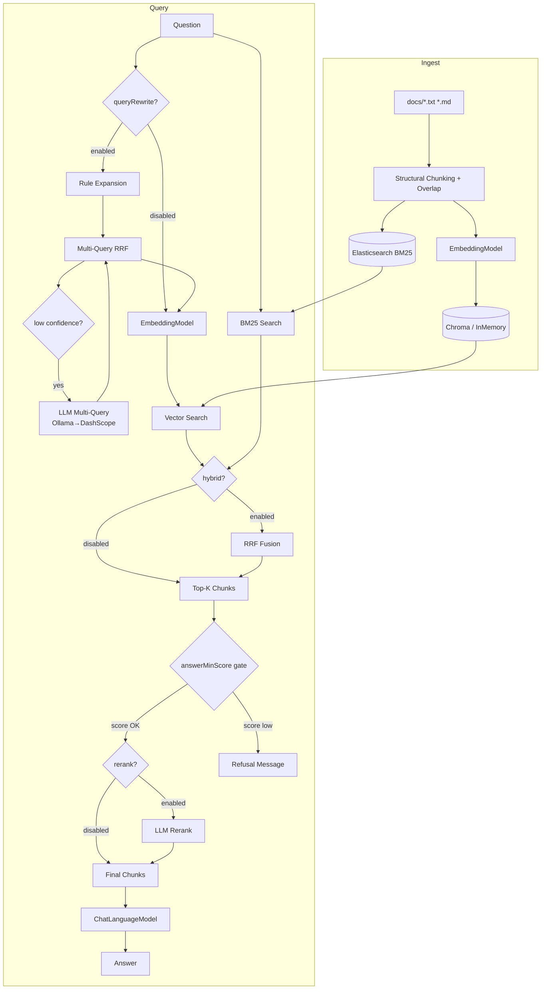
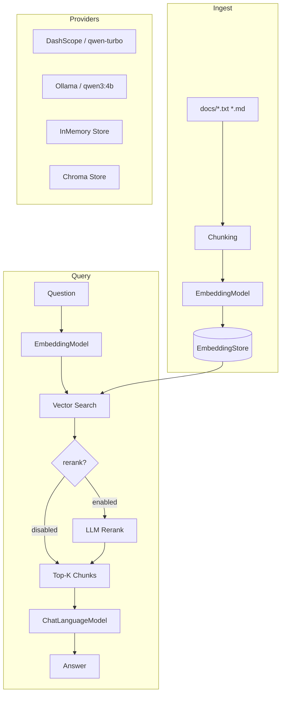

# LangChain4j + Spring Boot — Pluggable RAG Demo

A Spring Boot project integrating LangChain4j with **pluggable LLM and Embedding providers** (DashScope / Ollama) and a **pluggable vector store** (InMemory / Chroma), with optional **hybrid retrieval** (Vector + BM25 via Elasticsearch), **short-query rewriting** (rule expansion + LLM multi-query), and structural chunking with overlap.

---

## Architecture


```mermaid
graph TD
    subgraph Ingest
        A[docs/*.txt *.md] --> B[Structural Chunking + Overlap]
        B --> C[EmbeddingModel]
        C --> D[(Chroma / InMemory)]
        B --> E[(Elasticsearch BM25)]
    end
    subgraph Query
        Q[Question] --> RW{queryRewrite?}
        RW -- enabled --> RWR[Rule Expansion]
        RWR --> RWRRF[Multi-Query RRF]
        RWRRF --> LLM_T{low confidence?}
        LLM_T -- yes --> LLM_RW[LLM Multi-Query\nOllama→DashScope]
        LLM_RW --> RWRRF
        RW -- disabled --> F[EmbeddingModel]
        RWRRF --> F
        F --> G[Vector Search]
        D --> G
        Q --> H[BM25 Search]
        E --> H
        G --> I{hybrid?}
        H --> I
        I -- enabled --> J[RRF Fusion]
        I -- disabled --> K[Top-K Chunks]
        J --> K
        K --> L{answerMinScore gate}
        L -- score OK --> M{rerank?}
        L -- score low --> N[Refusal Message]
        M -- enabled --> O[LLM Rerank]
        M -- disabled --> P[Final Chunks]
        O --> P
        P --> R[ChatLanguageModel]
        R --> S[Answer]
    end
```

---

## Quick Start

### 1. Configure your API key

Create `src/main/resources/application-local.properties` (not committed):

```properties
# DashScope (default provider)
dashscope.api-key=your-real-dashscope-api-key

# Optional: RAG docs directory
# rag.docs.dir=/path/to/your/docs
```

### 2. Run with local profile

```bash
mvn spring-boot:run -Dspring-boot.run.profiles=local
```

Open http://localhost:8090 in your browser.

---

## Switching Providers

All providers are controlled by three properties (can also be set via env vars):

| Property | Options | Default | Env Var |
|----------|---------|---------|---------|
| `llm.provider` | `dashscope` \| `ollama` | `dashscope` | `LLM_PROVIDER` |
| `embedding.provider` | `dashscope` \| `ollama` | `dashscope` | `EMBEDDING_PROVIDER` |
| `vector.store` | `inmemory` \| `chroma` | `inmemory` | `VECTOR_STORE` |

### DashScope (default)

```properties
llm.provider=dashscope
embedding.provider=dashscope
dashscope.api-key=sk-...
dashscope.model=qwen-turbo
dashscope.model.strong=qwen-plus
dashscope.temperature=0.7
dashscope.embedding-model=text-embedding-v3
```

Switch to strong model:
```bash
DASHSCOPE_MODEL=qwen-plus mvn spring-boot:run -Dspring-boot.run.profiles=local
```

### Ollama (local)

First start Ollama:

```bash
# Pull models
ollama pull nomic-embed-text
ollama pull qwen3:4b

# Serve (defaults to http://localhost:11434)
ollama serve
```

Then configure:

```properties
llm.provider=ollama
embedding.provider=ollama
ollama.base-url=http://localhost:11434
ollama.chat-model=qwen3:4b
ollama.embedding-model=nomic-embed-text
ollama.temperature=0.7
ollama.timeout=60
```

Or via env vars:

```bash
LLM_PROVIDER=ollama EMBEDDING_PROVIDER=ollama mvn spring-boot:run -Dspring-boot.run.profiles=local
```

---

## Vector Store: Chroma

Start Chroma via Python (requires `chromadb` package):

```bash
pip install chromadb
chroma run --host 0.0.0.0 --port 8000 --path ./chroma-data
```

Then configure:

```properties
vector.store=chroma
chroma.base-url=http://localhost:8000
chroma.collection=rag-default
```

> **Chroma v2 API:** This project uses **LangChain4j ≥ 1.7.1** which targets the Chroma v2 REST API
> (`/api/v2/...` endpoints). Set `chroma.base-url` to the root of your Chroma server
> (e.g. `http://localhost:8000`); the `/api/v2` path prefix is handled automatically by the library.
>
> **Chroma 1.0.0 or later is required.** Older Chroma servers (< 1.0.0) that only expose the v1 API
> are not compatible with this configuration.

> **Important:** Use different collection names per embedding provider to avoid mixing vector spaces.
> E.g., `chroma.collection=rag-dashscope` vs `chroma.collection=rag-ollama`.

### Troubleshooting Chroma connection errors

| Symptom | Likely cause | Fix |
|---------|-------------|-----|
| `405 Method Not Allowed` or `404 Not Found` when starting with `vector.store=chroma` | Chroma server version < 1.0.0 (exposes only v1 API) | Upgrade Chroma: `pip install --upgrade chromadb` |
| `Connection refused` | Chroma is not running | Start it: `chroma run --host 0.0.0.0 --port 8000 --path ./chroma-data` |
| Bean creation error for `EmbeddingStore` on startup | `vector.store` property not resolved | Ensure `application-local.properties` or env var `VECTOR_STORE=chroma` is set |

---

## Hybrid Retrieval (Vector + BM25)

Hybrid retrieval combines dense vector search (Chroma) with sparse BM25 search (Elasticsearch)
using **Reciprocal Rank Fusion (RRF)** to produce a unified, higher-quality ranking.

### Why hybrid?

| Retrieval type | Strengths | Weaknesses |
|----------------|-----------|------------|
| Vector (dense) | Semantic similarity, paraphrase matching | Exact-match terms, rare keywords |
| BM25 (sparse) | Exact term matching, rare proper nouns | No semantic understanding |
| **Hybrid (RRF)** | Best of both worlds | Requires Elasticsearch |

### Step 1 — Start Elasticsearch locally (macOS M1 Pro / Apple Silicon)

The included `docker-compose.yml` starts a single-node Elasticsearch 8.x instance:

```bash
# Start Elasticsearch (detached)
docker-compose up -d

# Verify it's healthy
curl http://localhost:9200/_cluster/health

cd /Volumes/G/docker-file

# 启动
docker compose up -d

# 查看状态
docker compose ps

# 查看日志
docker compose logs elasticsearch

# 停止（容器停止，数据保留）
docker compose down

# 停止并删除数据
docker compose down -v

# 重启
docker compose restart

```

> **M1 Pro note:** The compose file is configured with `ES_JAVA_OPTS=-Xms512m -Xmx512m`
> to keep memory usage reasonable. Increase to `-Xmx1g` if you index very large corpora.

### Step 2 — Enable hybrid retrieval

Add to `src/main/resources/application-local.properties`:

```properties
# Enable hybrid retrieval
rag.hybrid.enabled=true
rag.bm25.enabled=true

# Elasticsearch endpoint (default: http://localhost:9200)
rag.bm25.elasticsearch.url=http://localhost:9200
rag.bm25.indexName=rag-chunks

# Candidates per retriever before RRF fusion (max 50, default 50)
rag.hybrid.candidateK=50

# RRF constant k (default 60 — the widely-used standard value)
rag.hybrid.rrf.k=60
```

### Step 3 — Reindex

Rebuild the vector + BM25 indexes together:

```bash
curl -X POST http://localhost:8090/api/rag/reindex
# {"chunksIndexed": 42}
```

The `/api/rag/reindex` endpoint now indexes chunks into both Chroma **and** Elasticsearch.

### RRF Fusion details

For each query the system:
1. Fetches `candidateK` (default 50) results from Chroma by cosine similarity.
2. Fetches `candidateK` results from Elasticsearch by BM25 score.
3. Assigns each result a rank within its retriever.
4. Computes a **weighted** fused RRF score:  
   `score = wVector * (1/(k + rankVector)) + wBm25 * (1/(k + rankBm25))`  
   where `wVector = rag.hybrid.rrf.vectorWeight` (default 1.0) and `wBm25 = rag.hybrid.rrf.bm25Weight` (default 1.0).
5. Sorts by fused score, applies `maxChunksPerDoc` diversification, and returns top `topK`.

#### Tuning weighted RRF with environment variables

To favor vector (semantic) retrieval over keyword matching, increase `vectorWeight`:

```bash
# Favor vector retrieval (2:1 vector/BM25)
RAG_HYBRID_RRF_VECTOR_WEIGHT=2.0 RAG_HYBRID_RRF_BM25_WEIGHT=1.0 \
  java -jar target/app.jar
```

Or in `application-local.properties`:

```properties
rag.hybrid.rrf.vectorWeight=2.0
rag.hybrid.rrf.bm25Weight=1.0
```

#### Why fusedScore (RRF) is not suitable for the answer confidence gate

The fused RRF score is a **rank-based** quantity, not a similarity measure:

- Its range is roughly `0.01–0.07` for typical settings (k=60, candidateK=50).
- It depends heavily on `k`, `candidateK`, and how many results each retriever returned.
- Even a perfectly relevant document in the top-1 position produces a score of only
  `1/(k+1) ≈ 0.016`, which is far below any sensible similarity-based threshold.

> **Example:** With `rag.answer.minScore=0.35`, every query is refused — both
> in-domain (`请假扣款有哪些项目`, top1 fusedScore ≈ 0.030) and out-of-domain
> (`今天天气怎么样`, top1 fusedScore ≈ 0.016) — because the RRF scale never reaches 0.35.

**Solution:** The gate is decoupled from fusion scoring.  When hybrid is active, the gate
uses two independent, scale-stable signals: `vectorTop1Score` (cosine similarity from
Chroma, range ≈ 0.2–0.9) and `bm25Hits` (integer count of ES hits).  Fusion still uses
RRF for ranking, but gating does not.

#### 5-run weighted RRF experiment

Run the eval script five times with different weight ratios and compare `hit@10`/`MRR`
in separate output directories:

```bash
# Run 1: equal weights (baseline)
RAG_HYBRID_RRF_VECTOR_WEIGHT=1.0 RAG_HYBRID_RRF_BM25_WEIGHT=1.0 \
  EVAL_OUT_DIR=eval/perf_v1b1 scripts/09_eval_csv_run_script.sh

# Run 2: 2× vector weight
RAG_HYBRID_RRF_VECTOR_WEIGHT=2.0 RAG_HYBRID_RRF_BM25_WEIGHT=1.0 \
  EVAL_OUT_DIR=eval/perf_v2b1 scripts/09_eval_csv_run_script.sh

# Run 3: 3× vector weight
RAG_HYBRID_RRF_VECTOR_WEIGHT=3.0 RAG_HYBRID_RRF_BM25_WEIGHT=1.0 \
  EVAL_OUT_DIR=eval/perf_v3b1 scripts/09_eval_csv_run_script.sh

# Run 4: 1× vector, 2× BM25
RAG_HYBRID_RRF_VECTOR_WEIGHT=1.0 RAG_HYBRID_RRF_BM25_WEIGHT=2.0 \
  EVAL_OUT_DIR=eval/perf_v1b2 scripts/09_eval_csv_run_script.sh

# Run 5: vector only (BM25 weight=0)
RAG_HYBRID_RRF_VECTOR_WEIGHT=1.0 RAG_HYBRID_RRF_BM25_WEIGHT=0.0 \
  EVAL_OUT_DIR=eval/perf_v1b0 scripts/09_eval_csv_run_script.sh
```

Compare `hit@10` and `MRR` across `eval/perf_*/` output directories to pick the best
weight combination for your corpus.

---

## API Endpoints

| Method | Path | Description |
|--------|------|-------------|
| POST | `/api/chat` | Chat with memory (sessionId) |
| POST | `/api/chat/stream` | Streaming chat (SSE) |
| POST | `/api/agent/chat` | Agent with tool calling |
| POST | `/api/rag/reindex` | Build/rebuild RAG index (vector + BM25 if enabled) |
| POST | `/api/rag/ask` | RAG-based question answering |
| GET  | `/api/rag/search?q=...` | Debug retrieval (topK + scores) |
| GET  | `/api/rag/stats?n=10` | Index stats + provider info |
| GET  | `/api/health` | Health check |
| GET  | `/api/config` | Active config info |

### Reindex

```bash
curl -X POST http://localhost:8090/api/rag/reindex
# {"chunksIndexed": 5}
```

### Ask

```bash
curl -X POST http://localhost:8090/api/rag/ask \
  -H "Content-Type: application/json" \
  -d '{"question": "What is RAG?"}'
```

### Search (debug retrieval quality)

```bash
curl "http://localhost:8090/api/rag/search?q=What+is+RAG"
# Returns topK results with scores, sourceId, textPreview, metadata
```

### Stats

```bash
curl "http://localhost:8090/api/rag/stats?n=20"
# {"chunks":5,"vectorDimMax":1536,"estimatedVectorBytes":30720,
#  "llmProvider":"dashscope","embeddingProvider":"dashscope","vectorStore":"inmemory",
#  "hybridEnabled":false,"bm25Available":false,"chunkOverlapChars":80,"answerMinScore":0.35,...}
```

---

## RAG Configuration

| Property | Default | Env Var | Description |
|----------|---------|---------|-------------|
| `rag.docs.dir` | _(empty)_ | `RAG_DOCS_DIR` | Directory of `.txt`/`.md` files to index |
| `rag.chunk.maxChars` | `500` | `RAG_CHUNK_MAX_CHARS` | Max characters per chunk |
| `rag.chunk.overlapChars` | `80` | `RAG_CHUNK_OVERLAP_CHARS` | Overlap chars between consecutive chunks (0 = off) |
| `rag.topK` | `3` | `RAG_TOP_K` | Number of chunks to retrieve |
| `rag.minScore` | `0.0` | `RAG_MIN_SCORE` | Minimum similarity score for vector retrieval |
| `rag.answer.minScore` | `0.35` | `RAG_ANSWER_MIN_SCORE` | Legacy confidence gate (non-hybrid only; see hybrid gate below) |
| `rag.rerank.enabled` | `false` | `RAG_RERANK_ENABLED` | Enable LLM-based reranking |
| `rag.rerank.topN` | `2` | `RAG_RERANK_TOP_N` | Number of chunks to keep after rerank |
| `rag.retrieve.maxChunksPerDoc` | `2` | `RAG_RETRIEVE_MAX_CHUNKS_PER_DOC` | Max chunks per docId (0 = disabled) |
| `rag.hybrid.enabled` | `false` | `RAG_HYBRID_ENABLED` | Enable hybrid (vector + BM25) retrieval |
| `rag.bm25.enabled` | `false` | `RAG_BM25_ENABLED` | Enable BM25 Elasticsearch index |
| `rag.bm25.elasticsearch.url` | `http://localhost:9200` | `RAG_BM25_ES_URL` | Elasticsearch base URL |
| `rag.bm25.indexName` | `rag-chunks` | `RAG_BM25_INDEX_NAME` | Elasticsearch index name |
| `rag.hybrid.candidateK` | `50` | `RAG_HYBRID_CANDIDATE_K` | Candidates per retriever before fusion |
| `rag.hybrid.rrf.k` | `60` | `RAG_HYBRID_RRF_K` | RRF constant k |
| `rag.hybrid.rrf.vectorWeight` | `1.0` | `RAG_HYBRID_RRF_VECTOR_WEIGHT` | RRF weight for vector retriever |
| `rag.hybrid.rrf.bm25Weight` | `1.0` | `RAG_HYBRID_RRF_BM25_WEIGHT` | RRF weight for BM25 retriever |
| `rag.answer.gate.enabled` | `true` | `RAG_ANSWER_GATE_ENABLED` | Enable hybrid-aware confidence gate |
| `rag.answer.gate.vectorStrong` | `0.55` | `RAG_ANSWER_GATE_VECTOR_STRONG` | Vector cosine strong-pass threshold |
| `rag.answer.gate.vectorWeak` | `0.30` | `RAG_ANSWER_GATE_VECTOR_WEAK` | Vector cosine weak-pass threshold (needs bm25MinHits) |
| `rag.answer.gate.bm25MinHits` | `1` | `RAG_ANSWER_GATE_BM25_MIN_HITS` | Min BM25 hits required for weak-pass |
| `rag.bm25.searchTopN` | `50` | `RAG_BM25_SEARCH_TOP_N` | BM25 search window for gate hit counting |
| `rag.queryRewrite.enabled` | `false` | `RAG_QUERY_REWRITE_ENABLED` | Enable short-query rewriting |

### Chunking Strategy

The chunking pipeline now operates in four stages:

1. **Heading splits**: Text is first split on Markdown headings (`# Title`, `## Section`, …)
   to keep sections together rather than splitting them across chunks.
2. **Paragraph splits**: Within each section, blank-line-separated paragraphs form chunk
   candidates.
3. **Sentence splits**: Paragraphs exceeding `chunkMaxChars` are split on sentence
   boundaries — Chinese (`。！？`) first, then English (`.!?`), then whitespace.
4. **Overlap**: The last `overlapChars` characters of each chunk are prepended to the
   next chunk, giving retrieval models cross-boundary context.

```properties
rag.chunk.maxChars=500      # hard limit per chunk
rag.chunk.overlapChars=80   # overlap (set to 0 to disable)
```

### Retrieval Diversity (`rag.retrieve.maxChunksPerDoc`)

When a corpus contains a large document that is broadly relevant to many queries, the raw
top-K ranking may return many chunks from that single document, crowding out other relevant
sources.

`rag.retrieve.maxChunksPerDoc` caps the number of chunks from any single `docId` that
appear in the final retrieval result.

```
# Prevent any one document from contributing more than 2 chunks to the top-K results.
rag.retrieve.maxChunksPerDoc=2

# Set to 0 to disable diversification and use the raw vector-store ranking.
rag.retrieve.maxChunksPerDoc=0
```

### Answer Confidence Gate

The confidence gate prevents the LLM from generating answers based on weakly-relevant
context (which often leads to hallucination or unhelpful responses).

#### Hybrid-aware gate (recommended when `rag.hybrid.enabled=true`)

When hybrid retrieval is active the gate is **decoupled from fusedScore** and uses two
independent, scale-stable signals:

- **`vectorTop1Score`** — top-1 cosine similarity from Chroma (range ≈ 0.2–0.9).  
  Stable across RRF parameter changes; reflects semantic relevance directly.
- **`bm25Hits`** — number of BM25 hits returned within `rag.bm25.searchTopN` (integer).  
  Reflects keyword evidence; robust to embedding model variation.

**Gate rule:**

| Condition | Decision |
|-----------|----------|
| `vectorTop1Score >= rag.answer.gate.vectorStrong` | ✅ PASS (strong semantic evidence) |
| `vectorTop1Score >= rag.answer.gate.vectorWeak` AND `bm25Hits >= rag.answer.gate.bm25MinHits` | ✅ PASS (moderate semantic + keyword evidence) |
| Neither condition met | ❌ REFUSE |

**Why not use fusedScore for the gate?**  
See [Why fusedScore (RRF) is not suitable for the answer confidence gate](#why-fusedscore-rrf-is-not-suitable-for-the-answer-confidence-gate) above.

**Gate diagnostics** are included in the `/api/rag/ask` response:

```json
{
  "question": "请假扣款有哪些项目",
  "answer": "...",
  "retrievedChunks": ["..."],
  "gateDiagnostics": {
    "gateEnabled": true,
    "hybridGate": true,
    "vectorTop1Score": 0.612,
    "bm25Hits": 7,
    "vectorStrong": 0.55,
    "vectorWeak": 0.30,
    "bm25MinHits": 1,
    "pass": true,
    "decision": "pass_vector_strong"
  }
}
```

**Tuning the hybrid gate:**

```properties
# application-local.properties
# Lower vectorStrong to allow more answers through
rag.answer.gate.vectorStrong=0.45
# Require at least 2 BM25 hits for weak-pass
rag.answer.gate.bm25MinHits=2
```

#### Legacy gate (`rag.answer.minScore`, non-hybrid mode only)

When `rag.hybrid.enabled=false`, the gate falls back to comparing the top-chunk
vector cosine score against `rag.answer.minScore`.

| `answerMinScore` value | Effect |
|------------------------|--------|
| `0.0` | Gate disabled; LLM always called with retrieved context. |
| `0.35` (default) | Queries with low retrieval confidence return a refusal message. |
| `0.5+` | Strict gate; good for high-precision use cases. |

> **Migration note:** If you previously set `rag.answer.minScore=0.35` with hybrid
> enabled, your gate was always triggering because fusedScore ≈ 0.016–0.065 never
> reached 0.35.  Enable the hybrid gate (`rag.answer.gate.enabled=true`, default) and
> tune `rag.answer.gate.vectorStrong` / `rag.answer.gate.vectorWeak` instead.

**Auto-calibrating the threshold:**
Run the eval harness — it now prints score percentile distributions and recommends a
threshold based on the p10 of answerable-query scores:

```bash
RAG_DOCS_DIR=eval/docs LLM_PROVIDER=ollama EMBEDDING_PROVIDER=ollama \
  mvn -DskipTests exec:java
```

The summary output includes:
```
── Score Distribution (answerable queries only: recallAtK=true) ─
  p10=0.4231  p25=0.5102  p50=0.6341  …

  ℹ Recommended rag.answer.minScore ≈ 0.423
```

### Tuning `rag.minScore` vs Refusal Accuracy

`rag.minScore` is the minimum cosine-similarity score a chunk must achieve to be included
in retrieval results.

| `minScore` value | Effect |
|-----------------|--------|
| `0.0` (default) | All retrieved chunks are returned; the LLM may answer questions that have no relevant context. |
| `0.3`–`0.5` | Chunks with low relevance are filtered out; improves refusal accuracy for off-topic questions at the cost of lower hit-rate for borderline queries. |
| `> 0.6` | Very strict; good refusal accuracy but may return empty results for legitimate questions. |

**Recommended workflow:**
1. Start with `minScore=0.0` and inspect score distributions via `/api/rag/search`.
2. Raise `minScore` incrementally until off-topic queries return no results without dropping hit rate on valid questions.
3. Use `rag.retrieve.maxChunksPerDoc=2` together with a moderate `minScore` (e.g. `0.3`) for the best balance between diversity and refusal accuracy.
4. Use the eval harness to auto-calibrate `rag.answer.minScore`.

### LLM Rerank

When `rag.rerank.enabled=true`, after retrieving `topK` chunks the system asks the chat model to select the `topN` most relevant chunk IDs (via structured JSON). This is a lightweight, model-agnostic approach that works with both DashScope and Ollama.

> **M1 Pro note:** Rerank is off by default (`rag.rerank.enabled=false`) to keep latency
> low on CPU-only hardware. Enable it selectively for high-value queries.

---

## Query Rewriting (Strategy B)

Query rewriting improves retrieval quality for short Chinese queries (e.g. 假期, 薪酬, 资产化)
by generating multiple query variants before retrieval and fusing results via multi-query RRF.

### Strategy B (default)

1. **Rule expansion** (always runs first, zero LLM cost): generates suffix variants such as  
   `资产化` → `资产化能力`, `资产化平台`, `资产化流程`
2. **LLM multi-query** (triggered only when short query AND fused top-1 score is still low):  
   calls the configured chat model (Ollama by default, DashScope as fallback) to produce  
   2–3 semantically diverse query variants.
3. **Multi-query RRF fusion**: retrieval is run for each variant and results are fused  
   across all (variant, retriever) rankings using RRF.

### Enabling Query Rewriting

Add to `src/main/resources/application-local.properties`:

```properties
# Enable Strategy B query rewriting
rag.queryRewrite.enabled=true

# LLM provider for rewrite calls (default: ollama; fallback: dashscope)
rag.queryRewrite.provider=ollama
rag.queryRewrite.fallbackProvider=dashscope

# Short-query range: only queries within this character-count range trigger expansion
rag.queryRewrite.shortQuery.minLen=2
rag.queryRewrite.shortQuery.maxLen=6

# Rule expansion (always-on for short queries when rewriting is enabled)
rag.queryRewrite.ruleExpansion.enabled=true
rag.queryRewrite.ruleExpansion.maxVariants=3

# LLM expansion (conditional: only fires when topScore < minTopScore)
rag.queryRewrite.llmExpansion.enabled=true
rag.queryRewrite.llmExpansion.maxVariants=3

# LLM trigger threshold: lower = LLM fires less often (more conservative)
rag.queryRewrite.llmTrigger.minTopScore=0.02
```

> **M1 Pro note:** The LLM trigger threshold (`0.02`) is intentionally conservative.
> With RRF scores in the `0.01–0.03` range even for good matches, the LLM will only
> fire for genuinely zero-recall queries. Increase to `0.03` if you want LLM to trigger
> more often.

### Query Rewriting Configuration Reference

| Property | Default | Env Var | Description |
|----------|---------|---------|-------------|
| `rag.queryRewrite.enabled` | `false` | `RAG_QUERY_REWRITE_ENABLED` | Enable query rewriting |
| `rag.queryRewrite.provider` | `ollama` | `RAG_QUERY_REWRITE_PROVIDER` | Primary LLM provider for rewriting |
| `rag.queryRewrite.fallbackProvider` | `dashscope` | `RAG_QUERY_REWRITE_FALLBACK_PROVIDER` | Fallback LLM provider |
| `rag.queryRewrite.shortQuery.minLen` | `2` | `RAG_QUERY_REWRITE_SHORT_MIN_LEN` | Min query length (chars) for expansion |
| `rag.queryRewrite.shortQuery.maxLen` | `6` | `RAG_QUERY_REWRITE_SHORT_MAX_LEN` | Max query length (chars) for expansion |
| `rag.queryRewrite.ruleExpansion.enabled` | `true` | `RAG_QUERY_REWRITE_RULE_ENABLED` | Enable rule-based expansion |
| `rag.queryRewrite.ruleExpansion.maxVariants` | `3` | `RAG_QUERY_REWRITE_RULE_MAX_VARIANTS` | Max rule variants to generate |
| `rag.queryRewrite.llmExpansion.enabled` | `true` | `RAG_QUERY_REWRITE_LLM_ENABLED` | Enable LLM multi-query rewrite |
| `rag.queryRewrite.llmExpansion.maxVariants` | `3` | `RAG_QUERY_REWRITE_LLM_MAX_VARIANTS` | Max LLM variants to generate |
| `rag.queryRewrite.llmTrigger.minTopScore` | `0.02` | `RAG_QUERY_REWRITE_LLM_TRIGGER_SCORE` | Fused score threshold to trigger LLM |

### Search Response with Diagnostics

When rewriting is enabled, `/api/rag/search` returns an extra `rewriteDiagnostics` field:

```json
{
  "question": "资产化",
  "results": [...],
  "rewriteDiagnostics": {
    "rewriteEnabled": true,
    "ruleExpansionRan": true,
    "llmExpansionRan": false,
    "variantQueries": ["资产化", "资产化能力", "资产化平台", "资产化流程"],
    "triggerReason": "rule_expansion"
  }
}
```

Individual result entries may include a `matchedVariants` field when multiple variant
queries retrieved the same chunk:

```json
{
  "sourceId": "...",
  "score": 0.0314,
  "matchedVariants": ["资产化", "资产化能力"],
  ...
}
```

---

## Short-Query Regression Runner

A regression runner lets you compare retrieval quality for a fixed set of short queries
before and after configuration changes — without needing manual labels.

The runner tests these 5 short queries: **假期 · 薪酬 · 资产化 · 绩效 · 领导力**

### Option A: Shell script (recommended)

```bash
# Run against local server (default port 8090, k=10)
./eval/short_query_regression.sh

# Custom URL and k
./eval/short_query_regression.sh http://localhost:8090 10
```

Sample output:

```
════════════════════════════════════════════════════════════════
Query: [资产化]

Rewrite diagnostics:
  enabled       : true
  ruleRan       : true
  llmRan        : false
  triggerReason : rule_expansion
  variants      : 资产化, 资产化能力, 资产化平台, 资产化流程

Results: 10

   1. score=0.04166  WEF_Global_Lighthouse_Network_2025_CN.txt#chunk=68
      行资产化, 实现规| 准手册、程序和工具...
   2. score=0.03333  企业数字化转型对绩效的影响研究.txt#chunk=25 [matched: 资产化 资产化能力]
      化战略的实施助力南钢股份...
...
```

### Option B: Java runner

```bash
# Start the Spring Boot server first, then:
mvn compile exec:java -Dexec.mainClass=com.example.demo.eval.ShortQueryRegressionRunner

# Custom URL and k
mvn compile exec:java \
  -Dexec.mainClass=com.example.demo.eval.ShortQueryRegressionRunner \
  -Dexec.args="http://localhost:8090 10"
```

### Workflow: before/after comparison

```bash
# 1. Run with rewriting OFF (baseline)
# Set rag.queryRewrite.enabled=false in application-local.properties
./eval/short_query_regression.sh > /tmp/before.txt

# 2. Enable rewriting and restart server, then run again
# Set rag.queryRewrite.enabled=true
./eval/short_query_regression.sh > /tmp/after.txt

# 3. Compare
diff /tmp/before.txt /tmp/after.txt
```

---

## Evaluation Harness

Run evaluations against `eval/cases.jsonl`:

```bash
# Uses eval Spring profile, no real API key needed for InMemory+Ollama combo
RAG_DOCS_DIR=eval/docs LLM_PROVIDER=ollama EMBEDDING_PROVIDER=ollama \
  mvn -DskipTests exec:java
```

Each case in `eval/cases.jsonl` is a JSON object:
```json
{"id": "c01", "question": "What is RAG?", "relevant": ["rag-intro"], "ask": false}
```

Fields:
- `id` — unique case identifier
- `question` — the query to evaluate
- `relevant` — list of docId substrings expected in retrieved results (for Recall@K)
- `ask` — (optional) also run full `ask()` and record answer

Results are written to `eval/results.csv` and a summary table is printed to stdout,
including score percentile distributions and a recommended `rag.answer.minScore`.

---

## Comparison Matrix

| Dimension | Option A | Option B |
|-----------|----------|----------|
| **Embedding** | DashScope `text-embedding-v3` | Ollama `nomic-embed-text` |
| **Chat** | DashScope `qwen-turbo` | Ollama `qwen3:4b` |
| **Strong Chat** | DashScope `qwen-plus` | — |
| **Vector Store** | InMemory | Chroma |
| **BM25 Store** | _(none)_ | Elasticsearch 8.x |
| **Retrieval** | Vector-only | Hybrid (Vector + BM25 RRF) |

---

## Running Tests

```bash
# Default (local profile with dummy key)
mvn test

# With a real DashScope key
DASHSCOPE_API_KEY=your-key mvn test
```

Tests use `@ActiveProfiles("local")` and `src/test/resources/application-local.properties` with a dummy key so no real API calls are made.


---

## Architecture


```mermaid
graph TD
    subgraph Ingest
        A[docs/*.txt *.md] --> B[Chunking]
        B --> C[EmbeddingModel]
        C --> D[(EmbeddingStore)]
    end
    subgraph Query
        Q[Question] --> E[EmbeddingModel]
        E --> F[Vector Search]
        D --> F
        F --> G{rerank?}
        G -- enabled --> H[LLM Rerank]
        G -- disabled --> I[Top-K Chunks]
        H --> I
        I --> J[ChatLanguageModel]
        J --> K[Answer]
    end
    subgraph Providers
        P1[DashScope / qwen-turbo]
        P2[Ollama / qwen3:4b]
        P3[InMemory Store]
        P4[Chroma Store]
    end
```

---

## Quick Start

### 1. Configure your API key

Create `src/main/resources/application-local.properties` (not committed):

```properties
# DashScope (default provider)
dashscope.api-key=your-real-dashscope-api-key

# Optional: RAG docs directory
# rag.docs.dir=/path/to/your/docs
```

### 2. Run with local profile

```bash
mvn spring-boot:run -Dspring-boot.run.profiles=local
```

Open http://localhost:8090 in your browser.

---

## Switching Providers

All providers are controlled by three properties (can also be set via env vars):

| Property | Options | Default | Env Var |
|----------|---------|---------|---------|
| `llm.provider` | `dashscope` \| `ollama` | `dashscope` | `LLM_PROVIDER` |
| `embedding.provider` | `dashscope` \| `ollama` | `dashscope` | `EMBEDDING_PROVIDER` |
| `vector.store` | `inmemory` \| `chroma` | `inmemory` | `VECTOR_STORE` |

### DashScope (default)

```properties
llm.provider=dashscope
embedding.provider=dashscope
dashscope.api-key=sk-...
dashscope.model=qwen-turbo
dashscope.model.strong=qwen-plus
dashscope.temperature=0.7
dashscope.embedding-model=text-embedding-v3
```

Switch to strong model:
```bash
DASHSCOPE_MODEL=qwen-plus mvn spring-boot:run -Dspring-boot.run.profiles=local
```

### Ollama (local)

First start Ollama:

```bash
# Pull models
ollama pull nomic-embed-text
ollama pull qwen3:4b

# Serve (defaults to http://localhost:11434)
ollama serve
```

Then configure:

```properties
llm.provider=ollama
embedding.provider=ollama
ollama.base-url=http://localhost:11434
ollama.chat-model=qwen3:4b
ollama.embedding-model=nomic-embed-text
ollama.temperature=0.7
ollama.timeout=60
```

Or via env vars:

```bash
LLM_PROVIDER=ollama EMBEDDING_PROVIDER=ollama mvn spring-boot:run -Dspring-boot.run.profiles=local
```

---

## Vector Store: Chroma

Start Chroma via Python (requires `chromadb` package):

```bash
pip install chromadb
chroma run --host 0.0.0.0 --port 8000 --path ./chroma-data
```

Then configure:

```properties
vector.store=chroma
chroma.base-url=http://localhost:8000
chroma.collection=rag-default
```

> **Chroma v2 API:** This project uses **LangChain4j ≥ 1.7.1** which targets the Chroma v2 REST API
> (`/api/v2/...` endpoints). Set `chroma.base-url` to the root of your Chroma server
> (e.g. `http://localhost:8000`); the `/api/v2` path prefix is handled automatically by the library.
>
> **Chroma 1.0.0 or later is required.** Older Chroma servers (< 1.0.0) that only expose the v1 API
> are not compatible with this configuration.

> **Important:** Use different collection names per embedding provider to avoid mixing vector spaces.
> E.g., `chroma.collection=rag-dashscope` vs `chroma.collection=rag-ollama`.

### Troubleshooting Chroma connection errors

| Symptom | Likely cause | Fix |
|---------|-------------|-----|
| `405 Method Not Allowed` or `404 Not Found` when starting with `vector.store=chroma` | Chroma server version < 1.0.0 (exposes only v1 API) | Upgrade Chroma: `pip install --upgrade chromadb` |
| `Connection refused` | Chroma is not running | Start it: `chroma run --host 0.0.0.0 --port 8000 --path ./chroma-data` |
| Bean creation error for `EmbeddingStore` on startup | `vector.store` property not resolved | Ensure `application-local.properties` or env var `VECTOR_STORE=chroma` is set |

---

## API Endpoints

| Method | Path | Description |
|--------|------|-------------|
| POST | `/api/chat` | Chat with memory (sessionId) |
| POST | `/api/chat/stream` | Streaming chat (SSE) |
| POST | `/api/agent/chat` | Agent with tool calling |
| POST | `/api/rag/reindex` | Build/rebuild RAG index |
| POST | `/api/rag/ask` | RAG-based question answering |
| GET  | `/api/rag/search?q=...` | Debug retrieval (topK + scores) |
| GET  | `/api/rag/stats?n=10` | Index stats + provider info |
| GET  | `/api/health` | Health check |
| GET  | `/api/config` | Active config info |

### Reindex

```bash
curl -X POST http://localhost:8090/api/rag/reindex
# {"chunksIndexed": 5}
```

### Ask

```bash
curl -X POST http://localhost:8090/api/rag/ask \
  -H "Content-Type: application/json" \
  -d '{"question": "What is RAG?"}'
```

### Search (debug retrieval quality)

```bash
curl "http://localhost:8090/api/rag/search?q=What+is+RAG"
# Returns topK results with scores, sourceId, textPreview, metadata
```

### Stats

```bash
curl "http://localhost:8090/api/rag/stats?n=20"
# {"chunks":5,"vectorDimMax":1536,"estimatedVectorBytes":30720,
#  "llmProvider":"dashscope","embeddingProvider":"dashscope","vectorStore":"inmemory",...}
```

---

## RAG Configuration

| Property | Default | Env Var | Description |
|----------|---------|---------|-------------|
| `rag.docs.dir` | _(empty)_ | `RAG_DOCS_DIR` | Directory of `.txt`/`.md` files to index |
| `rag.chunk.maxChars` | `500` | `RAG_CHUNK_MAX_CHARS` | Max characters per chunk |
| `rag.topK` | `3` | `RAG_TOP_K` | Number of chunks to retrieve |
| `rag.minScore` | `0.0` | `RAG_MIN_SCORE` | Minimum similarity score threshold |
| `rag.rerank.enabled` | `false` | `RAG_RERANK_ENABLED` | Enable LLM-based reranking |
| `rag.rerank.topN` | `2` | `RAG_RERANK_TOP_N` | Number of chunks to keep after rerank |
| `rag.retrieve.maxChunksPerDoc` | `2` | `RAG_RETRIEVE_MAX_CHUNKS_PER_DOC` | Max chunks per docId returned in one retrieval (0 = disabled) |

### Retrieval Diversity (`rag.retrieve.maxChunksPerDoc`)

When a corpus contains a large document that is broadly relevant to many queries, the raw
top-K ranking may return many chunks from that single document, crowding out other relevant
sources.  For example, with the default `topK=10`, all 10 results might share the same
`docId`, making changes to `k` have no effect and degrading `hit@k` metrics for other
documents.

`rag.retrieve.maxChunksPerDoc` caps the number of chunks from any single `docId` that
appear in the final retrieval result.  When diversification is active, the service fetches
more candidates from the vector store (`limit × maxChunksPerDoc`) and then applies the
per-doc cap, so the returned list still contains up to `topK` results but drawn from
multiple documents.

```
# Prevent any one document from contributing more than 2 chunks to the top-K results.
rag.retrieve.maxChunksPerDoc=2

# Set to 0 to disable diversification and use the raw vector-store ranking.
rag.retrieve.maxChunksPerDoc=0
```

### Tuning `rag.minScore` vs Refusal Accuracy

`rag.minScore` is the minimum cosine-similarity score a chunk must achieve to be included
in retrieval results.

| `minScore` value | Effect |
|-----------------|--------|
| `0.0` (default) | All retrieved chunks are returned; the LLM may answer questions that have no relevant context. |
| `0.3`–`0.5` | Chunks with low relevance are filtered out; improves refusal accuracy for off-topic questions at the cost of lower hit-rate for borderline queries. |
| `> 0.6` | Very strict; good refusal accuracy but may return empty results for legitimate questions. |

**Recommended workflow:**
1. Start with `minScore=0.0` and inspect score distributions via `/api/rag/search`.
2. Raise `minScore` incrementally until off-topic queries return no results without dropping hit rate on valid questions.
3. Use `rag.retrieve.maxChunksPerDoc=2` together with a moderate `minScore` (e.g. `0.3`) for the best balance between diversity and refusal accuracy.

### LLM Rerank

When `rag.rerank.enabled=true`, after retrieving `topK` chunks the system asks the chat model to select the `topN` most relevant chunk IDs (via structured JSON). This is a lightweight, model-agnostic approach that works with both DashScope and Ollama.

---

## Evaluation Harness

Run evaluations against `eval/cases.jsonl`:

```bash
# Uses eval Spring profile, no real API key needed for InMemory+Ollama combo
RAG_DOCS_DIR=eval/docs LLM_PROVIDER=ollama EMBEDDING_PROVIDER=ollama \
  mvn -DskipTests exec:java
```

Each case in `eval/cases.jsonl` is a JSON object:
```json
{"id": "c01", "question": "What is RAG?", "relevant": ["rag-intro"], "ask": false}
```

Fields:
- `id` — unique case identifier
- `question` — the query to evaluate
- `relevant` — list of docId substrings expected in retrieved results (for Recall@K)
- `ask` — (optional) also run full `ask()` and record answer

Results are written to `eval/results.csv` and a summary table is printed to stdout.

---

## Comparison Matrix

| Dimension | Option A | Option B |
|-----------|----------|----------|
| **Embedding** | DashScope `text-embedding-v3` | Ollama `nomic-embed-text` |
| **Chat** | DashScope `qwen-turbo` | Ollama `qwen3:4b` |
| **Strong Chat** | DashScope `qwen-plus` | — |
| **Vector Store** | InMemory | Chroma |

---

## Running Tests

```bash
# Default (local profile with dummy key)
mvn test

# With a real DashScope key
DASHSCOPE_API_KEY=your-key mvn test
```

Tests use `@ActiveProfiles("local")` and `src/test/resources/application-local.properties` with a dummy key so no real API calls are made.

---

## Future Work

- BGE/M3E local embeddings via Ollama or HuggingFace
- Citation rate and refusal accuracy metrics in eval harness
- Persistent reindex across restarts (Chroma is already persistent)
- Hybrid search (BM25 + dense vector)
